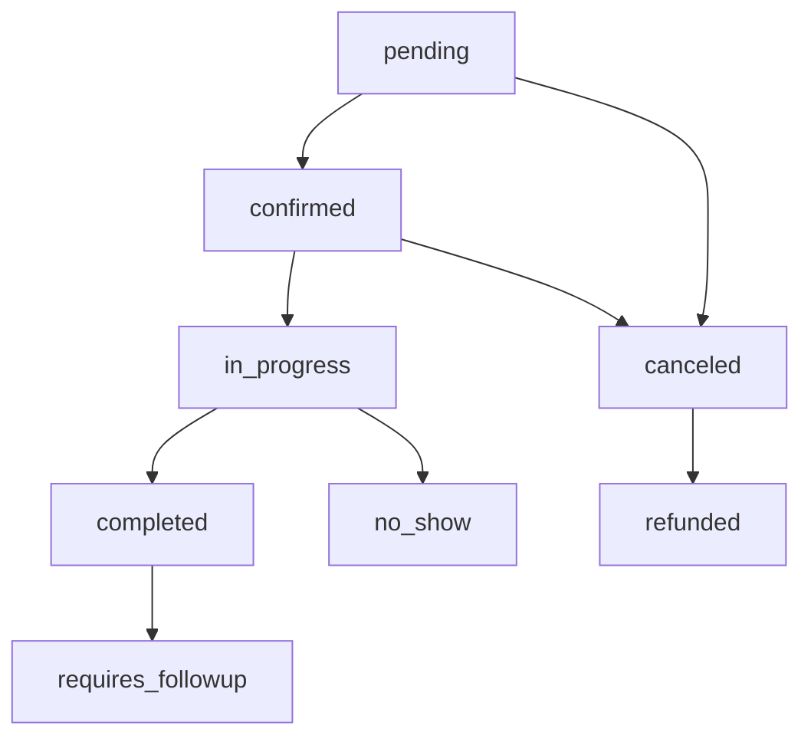
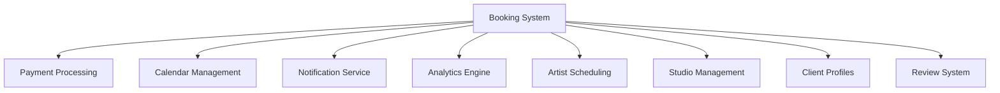

# Bookings

The booking system is the core transaction mechanism of the Tattoo API, handling appointment scheduling, payment processing, and status management between clients and artists.

## Booking Lifecycle

<Steps>
  <Step title="Booking Creation">
    Client creates a booking request with artist, date, and service details
  </Step>
  <Step title="Availability Check">
    System validates artist availability and prevents scheduling conflicts
  </Step>
  <Step title="Payment Processing">
    Deposit or full payment is processed through Stripe integration
  </Step>
  <Step title="Confirmation">
    Booking is confirmed and both parties receive notifications
  </Step>
  <Step title="Completion">
    After the appointment, booking is marked as completed
  </Step>
</Steps>

## Booking Object

A comprehensive booking contains all appointment and transaction details:

```json Booking Example
{
  "id": "booking_abc123",
  "client_id": "client_456",
  "artist_id": "artist_789",
  "studio_id": "studio_321",
  "status": "confirmed",
  "appointment_date": "2024-02-15T14:00:00Z",
  "duration_minutes": 180,
  "service_type": "custom_design",
  "tattoo_details": {
    "style": "traditional",
    "size": "medium",
    "placement": "upper_arm",
    "color": "black_and_grey",
    "description": "Traditional ship tattoo with nautical elements"
  },
  "pricing": {
    "base_price": 45000,
    "deposit_amount": 15000,
    "total_amount": 45000,
    "hourly_rate": 15000,
    "currency": "usd"
  },
  "payment_status": "deposit_paid",
  "payments": [
    {
      "id": "payment_def456",
      "amount": 15000,
      "type": "deposit",
      "status": "succeeded",
      "payment_date": "2024-01-15T10:30:00Z"
    }
  ],
  "consultation": {
    "required": true,
    "completed": false,
    "scheduled_date": "2024-02-01T11:00:00Z"
  },
  "booking_source": "web_app",
  "special_requests": "Please schedule during afternoon hours",
  "created_at": "2024-01-15T10:00:00Z",
  "updated_at": "2024-01-15T10:30:00Z",
  "metadata": {
    "referral_source": "instagram",
    "first_time_client": true
  }
}
```

## Booking Status Workflow

Bookings progress through a well-defined status workflow:



### Status Definitions

| Status | Description | Allowed Transitions |
|--------|-------------|-------------------|
| **pending** | Initial booking request awaiting payment | confirmed, canceled |
| **confirmed** | Booking confirmed with deposit/payment | in_progress, canceled |
| **in_progress** | Appointment currently happening | completed, no_show |
| **completed** | Appointment finished successfully | requires_followup |
| **canceled** | Booking canceled by client or artist | refunded |
| **no_show** | Client didn't show up for appointment | - |
| **refunded** | Payment has been refunded | - |
| **requires_followup** | Completed booking needs additional care | - |

## Conflict Detection

The booking system automatically prevents scheduling conflicts:

<CardGroup cols={2}>
  <Card title="Artist Availability" icon="calendar-check">
    Ensures artist is available at requested time
  </Card>
  <Card title="Studio Hours" icon="clock">
    Validates booking is within studio operating hours
  </Card>
  <Card title="Buffer Time" icon="hourglass">
    Maintains required buffer time between appointments
  </Card>
  <Card title="Block Scheduling" icon="ban">
    Respects artist's blocked/unavailable time slots
  </Card>
</CardGroup>

### Conflict Resolution

When conflicts are detected, the system provides alternatives:

```json Conflict Response
{
  "success": false,
  "error": {
    "code": "scheduling_conflict",
    "message": "The requested time slot is not available",
    "details": {
      "requested_time": "2024-02-15T14:00:00Z",
      "conflict_type": "artist_unavailable",
      "suggested_alternatives": [
        {
          "date": "2024-02-15T16:00:00Z",
          "duration_available": 240,
          "artist_preference": "high"
        },
        {
          "date": "2024-02-16T14:00:00Z", 
          "duration_available": 300,
          "artist_preference": "medium"
        }
      ]
    }
  }
}
```

## Payment Integration

Bookings are tightly integrated with the payment system:

<AccordionGroup>
  <Accordion title="Deposit Bookings">
    Most bookings require a deposit (typically 30-50% of total cost) to secure the appointment. The remaining balance is collected before or after the appointment.
  </Accordion>

  <Accordion title="Full Payment Bookings">
    Some artists or studios require full payment upfront, especially for smaller tattoos or first-time clients.
  </Accordion>

  <Accordion title="Payment Plans">
    For larger tattoos, the system supports payment plans with multiple scheduled payments leading up to the appointment.
  </Accordion>

  <Accordion title="Cancellation Policies">
    Each booking includes cancellation terms, with deposits often non-refundable within 48-72 hours of the appointment.
  </Accordion>
</AccordionGroup>

## Advanced Booking Features

### Recurring Bookings

For multi-session tattoos, the system supports recurring bookings:

```json Recurring Booking
{
  "id": "booking_series_123",
  "type": "recurring",
  "total_sessions": 4,
  "session_interval": "weeks",
  "interval_count": 2,
  "sessions": [
    {
      "session_number": 1,
      "booking_id": "booking_abc123",
      "scheduled_date": "2024-02-15T14:00:00Z",
      "status": "confirmed"
    },
    {
      "session_number": 2,
      "booking_id": "booking_def456", 
      "scheduled_date": "2024-03-01T14:00:00Z",
      "status": "pending"
    }
  ]
}
```

### Group Bookings

Support for multiple clients booking together:

```json Group Booking
{
  "id": "group_booking_456",
  "type": "group",
  "primary_client_id": "client_123",
  "participants": [
    {
      "client_id": "client_123",
      "booking_id": "booking_abc123",
      "tattoo_details": {...}
    },
    {
      "client_id": "client_456", 
      "booking_id": "booking_def456",
      "tattoo_details": {...}
    }
  ],
  "group_discount": 10,
  "synchronized_timing": true
}
```

## Consultation Management

Many bookings include a consultation phase:

<Steps>
  <Step title="Consultation Booking">
    Separate consultation appointment scheduled before main tattoo session
  </Step>
  <Step title="Design Discussion">
    Artist and client discuss design, placement, and pricing
  </Step>
  <Step title="Final Approval">
    Client approves final design and confirms main appointment
  </Step>
  <Step title="Payment Collection">
    Full payment collected based on consultation outcome
  </Step>
</Steps>

### Consultation Types

| Type | Duration | Cost | Purpose |
|------|----------|------|---------|
| **Brief** | 15-30 min | Free | Simple design confirmation |
| **Standard** | 30-60 min | $50-100 | Design discussion and sizing |
| **Extended** | 60-90 min | $100-200 | Complex design development |
| **Virtual** | 30-45 min | $25-75 | Remote consultation via video |

## Booking Analytics

Track booking performance and patterns:

<CardGroup cols={2}>
  <Card title="Conversion Rates" icon="chart-line">
    Track conversion from inquiry to confirmed booking
  </Card>
  <Card title="Cancellation Patterns" icon="chart-bar">
    Analyze cancellation reasons and timing
  </Card>
  <Card title="Peak Times" icon="clock">
    Identify popular booking times and days
  </Card>
  <Card title="Revenue per Booking" icon="dollar-sign">
    Calculate average booking values and trends
  </Card>
</CardGroup>

## Booking Preferences

Clients can set booking preferences for personalized experiences:

```json Client Booking Preferences
{
  "client_id": "client_123",
  "preferences": {
    "preferred_days": ["saturday", "sunday"],
    "preferred_times": ["morning", "afternoon"],
    "advance_booking_days": 14,
    "notification_preferences": {
      "email": true,
      "sms": true,
      "push": false,
      "reminder_times": ["24_hours", "2_hours"]
    },
    "payment_preferences": {
      "auto_pay_deposits": true,
      "saved_payment_methods": ["pm_123", "pm_456"],
      "payment_plan_eligible": true
    },
    "accessibility_needs": {
      "wheelchair_accessible": false,
      "hearing_impaired": false,
      "other_requirements": ""
    }
  }
}
```

## Notification System

Comprehensive notification system keeps all parties informed:

### Notification Types

<AccordionGroup>
  <Accordion title="Booking Confirmations">
    Sent immediately when booking is confirmed with payment
  </Accordion>

  <Accordion title="Appointment Reminders">
    Sent 24 hours and 2 hours before appointment
  </Accordion>

  <Accordion title="Schedule Changes">
    Sent when appointments are rescheduled or modified
  </Accordion>

  <Accordion title="Payment Reminders">
    Sent for remaining balance due dates
  </Accordion>

  <Accordion title="Completion Follow-ups">
    Sent after appointment with care instructions and review requests
  </Accordion>
</AccordionGroup>

## Integration Points

Bookings integrate with multiple system components:



## Best Practices

<Tip>
**Buffer Time**: Always include buffer time between appointments for setup, cleanup, and client transition.
</Tip>

<Tip>
**Clear Policies**: Maintain clear cancellation and rescheduling policies to minimize conflicts and ensure fair treatment.
</Tip>

<Warning>
**Payment Security**: Never store raw payment information. Always use tokenized payment methods through Stripe.
</Warning>

<Warning>
**Time Zones**: Always store appointment times in UTC and convert to local time zones for display.
</Warning>

## Common Use Cases

<CardGroup cols={2}>
  <Card title="Walk-in Bookings" icon="door-open">
    Handle immediate availability and quick booking flow
  </Card>
  <Card title="Long-term Projects" icon="calendar-days">
    Manage multi-session tattoos spanning weeks or months
  </Card>
  <Card title="Event Bookings" icon="calendar-star">
    Special event bookings like tattoo conventions
  </Card>
  <Card title="Corporate Bookings" icon="building">
    Group bookings for corporate events or team building
  </Card>
</CardGroup>

## Related Concepts

<CardGroup cols={3}>
  <Card title="Artists" href="/concepts/artists">
    Learn about artist availability and scheduling
  </Card>
  <Card title="Studios" href="/concepts/studios">
    Understand studio operations and booking policies
  </Card>
  <Card title="Payments" href="/concepts/payments">
    Explore payment processing and financial workflows
  </Card>
</CardGroup>

## Next Steps

- [Create Booking](/api-reference/bookings/create) - Learn the booking creation process
- [Booking Management](/guides/booking-workflow) - Complete booking workflow guide
- [Payment Integration](/guides/payment-integration) - Integrate payments with bookings