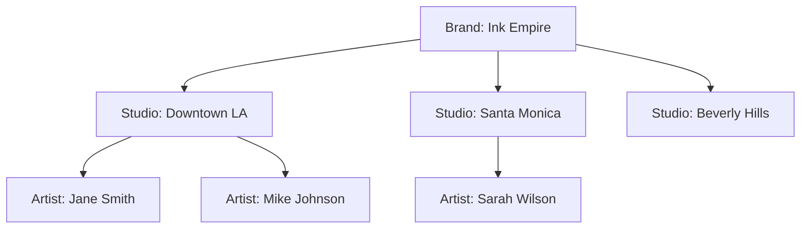

# Studios

Tattoo studios are the core entity of the Tattoo API. They represent physical locations where tattoo artists work and clients get tattoos. Understanding how studios work is essential for building applications with our API.

## Studio Object

A studio contains comprehensive information about a tattoo business location:

```json Studio Example
{
  "id": "studio_123",
  "name": "Ink Masters Studio",
  "description": "Premier tattoo studio in downtown LA specializing in traditional and neo-traditional work",
  "address": "123 Main Street",
  "city": "Los Angeles", 
  "state": "CA",
  "zip_code": "90210",
  "country": "USA",
  "latitude": 34.0522,
  "longitude": -118.2437,
  "phone": "+1-555-0123",
  "email": "info@inkmasters.com",
  "website": "https://inkmasters.com",
  "instagram": "@inkmasters",
  "rating": 4.8,
  "review_count": 127,
  "specialties": ["traditional", "neo-traditional", "black-and-grey"],
  "price_range": "$$$",
  "verified": true,
  "featured": false,
  "hours": {
    "monday": { "open": "10:00", "close": "20:00" },
    "tuesday": { "open": "10:00", "close": "20:00" },
    "sunday": { "closed": true }
  },
  "amenities": ["parking", "wifi", "consultation_room"],
  "images": [
    "https://cdn.tattoo.co/studios/studio_123/interior1.jpg"
  ]
}
```

## Studio Hierarchy

Studios operate within a hierarchical structure that supports business franchises and multi-location brands:

<Steps>
  <Step title="Brand Level">
    Top-level organization (e.g., "Ink Empire Tattoos")
  </Step>
  <Step title="Studio Level">
    Individual locations under a brand
  </Step>
  <Step title="Artist Level">
    Artists working at specific studios
  </Step>
</Steps>

### Brand-Studio Relationship



## Key Studio Features

### Location & Discovery

Studios can be discovered through multiple methods:

<CardGroup cols={2}>
  <Card title="Geographic Search" icon="location-dot">
    Find studios within a radius using latitude/longitude coordinates
  </Card>
  <Card title="City/State Filtering" icon="map">
    Filter studios by specific cities or states
  </Card>
  <Card title="Specialty Matching" icon="palette">
    Find studios that specialize in specific tattoo styles
  </Card>
  <Card title="Rating-Based Search" icon="star">
    Filter by minimum rating thresholds
  </Card>
</CardGroup>

### Studio Specialties

Common specialty categories include:

| Specialty | Description |
| --------- | ----------- |
| **Traditional** | Classic American tattoo style with bold lines and bright colors |
| **Realism** | Photorealistic tattoos that look like photographs |
| **Watercolor** | Artistic style mimicking watercolor paintings |
| **Geometric** | Patterns and shapes using geometric designs |
| **Japanese** | Traditional Japanese style with specific cultural motifs |
| **Black & Grey** | Monochromatic tattoos using only black ink and shading |
| **Neo-Traditional** | Modern twist on traditional style with enhanced detail |
| **Minimalist** | Simple, clean designs with minimal detail |

### Price Ranges

Studios are categorized into price ranges to help clients set expectations:

- **$** - Budget-friendly (under $100/hour)
- **$$** - Moderate pricing ($100-150/hour)  
- **$$$** - Premium pricing ($150-250/hour)
- **$$$$** - Luxury pricing ($250+/hour)

## Studio Verification

### Verification Process

Studios go through a verification process to ensure quality and legitimacy:

<Accordion title="Business License Verification">
  We verify that the studio has proper business licenses and permits required in their jurisdiction.
</Accordion>

<Accordion title="Health Department Compliance">
  Studios must demonstrate compliance with local health department regulations for tattoo establishments.
</Accordion>

<Accordion title="Artist Credentials">
  We verify that artists working at the studio have proper certifications and training.
</Accordion>

<Accordion title="Insurance Verification">
  Studios must provide proof of appropriate liability insurance coverage.
</Accordion>

### Verification Benefits

Verified studios receive:
- **Enhanced visibility** in search results
- **Trust badges** on their profiles
- **Priority placement** in featured listings
- **Access to premium features** like analytics and promotional tools

## Studio Management

### Adding a Studio

Only authorized users can add new studios to the platform:

```javascript Create Studio
const studioData = {
  name: "New Ink Studio",
  description: "Modern tattoo studio",
  address: "456 Art Street",
  city: "San Francisco",
  state: "CA",
  phone: "+1-555-0456",
  specialties: ["realism", "portrait"],
  price_range: "$$"
};

const response = await fetch('https://api.tattoo.co/v1/studios', {
  method: 'POST',
  headers: {
    'Authorization': 'Bearer YOUR_TOKEN',
    'Content-Type': 'application/json'
  },
  body: JSON.stringify(studioData)
});
```

### Updating Studio Information

Studio owners and managers can update their information:

```javascript Update Studio
const updates = {
  description: "Updated studio description",
  phone: "+1-555-0999",
  hours: {
    monday: { open: "09:00", close: "21:00" }
  }
};

const response = await fetch(`https://api.tattoo.co/v1/studios/${studioId}`, {
  method: 'PUT',
  headers: {
    'Authorization': 'Bearer YOUR_TOKEN',
    'Content-Type': 'application/json'
  },
  body: JSON.stringify(updates)
});
```

## Working with Studio Data

### Common Use Cases

<CardGroup cols={2}>
  <Card title="Studio Finder App" icon="magnifying-glass">
    Build apps that help users discover tattoo studios in their area
  </Card>
  <Card title="Studio Management" icon="chart-line">
    Create business management tools for studio owners
  </Card>
  <Card title="Review Platform" icon="star">
    Develop review and rating systems for tattoo studios
  </Card>
  <Card title="Booking Integration" icon="calendar">
    Integrate studio data with booking and appointment systems
  </Card>
</CardGroup>

### Best Practices

<Tip>
**Location Accuracy**: Always provide accurate latitude and longitude coordinates for the best user experience with location-based features.
</Tip>

<Warning>
**Data Freshness**: Studio information can change frequently. Implement caching strategies but refresh data regularly to ensure accuracy.
</Warning>

### Rate Limiting Considerations

Be mindful of rate limits when working with studio data:

- **Search endpoints**: 50 requests per minute
- **Individual studio endpoints**: 100 requests per minute
- **Bulk operations**: Consider pagination to stay within limits

## Studio Analytics

Studios provide rich analytics data for business insights:

```javascript Get Studio Analytics
const response = await fetch(`https://api.tattoo.co/v1/analytics/studio/${studioId}`, {
  headers: {
    'Authorization': 'Bearer YOUR_TOKEN'
  }
});

const analytics = await response.json();
// Returns: views, bookings, revenue, popular styles, etc.
```

## Related Concepts

<CardGroup cols={3}>
  <Card title="Artists" href="/concepts/artists">
    Learn about artist profiles and portfolios
  </Card>
  <Card title="Bookings" href="/concepts/bookings">
    Understand the booking and appointment system
  </Card>
  <Card title="Reviews" href="/concepts/reviews">
    Explore the review and rating system
  </Card>
</CardGroup>

## Next Steps

- [Browse Studio API endpoints](/api-reference/studios/list)
- [Learn about Studio Management](/guides/studio-management)
- [Explore Geographic Search](/guides/geographic-search)